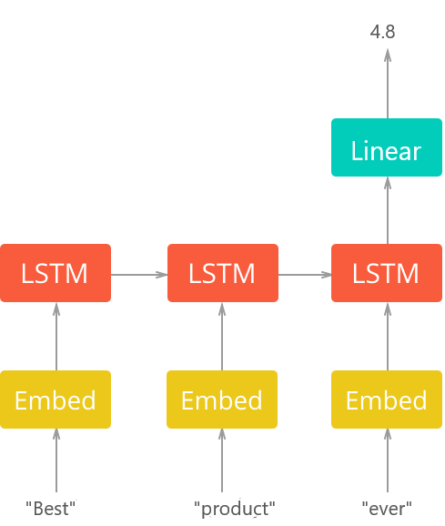

# 5-Stars Food Reviews Regressor
Building a simple regressor that predicts the review star of given food text review, **80%** accuracy was achieved and about **0.38** **M**ean-**S**quared **E**rror (MSE).
# How it Works
A neural network with Embedding layer as first layer, **L**ong & **S**hort **T**erm **M**emory (LSTMs) since text is sequential data, then one fully connected neuron (dense) with linear activation function for regression ( continuous ratings ). The basic architecture is in the image below:

# Requirements
- ## Dataset
[Amazon Fine Food Reviews](https://www.kaggle.com/snap/amazon-fine-food-reviews/): large dataset (more than 500K reviews ) that consists of reviews of fine foods from amazon.

Download and extract `Reviews.csv` to `data` folder (training will not work without)
- **keras** for creating, training and testing model.
- **sklearn** for utils like splitting data.
- **tqdm** for printing progress bars.
- **pandas**
- **numpy**
```
pip3 install requirements.txt
```
# Test
In case you want to test directly.
```
python test.py "Best Product Ever"
```
Output:
```
4.82/5
```
# Train
There is already a trained model in `results` folder. However you can tune some parameters in `config.py` to improve **MSE** such as number of LSTM units, embedding size, etc. then run:
```
python train.py
```